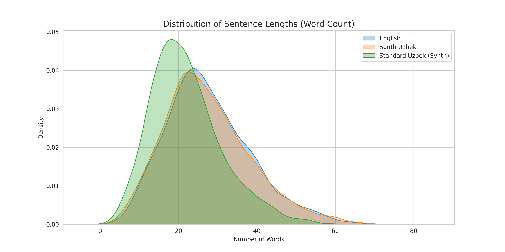

# Run
```bash 
git clone https://github.com/MLProjects/South_uzb_mt.git
cd South_uzb_mt
pip install uv
uv sync
cd submission
uv run run_evaluation.py
uv run mlflow ui --port 5001
```

# TL;DR

Написал бейзлайн решения на основе **M2M100** и **NLLB-200** — выбрал их, потому что это крупные открытые мультиязычные модели, которые:

* поддерживают сотни языков,
* работают в zero-shot режиме,
* и, что критично, NLLB-200 явно поддерживает узбекский в арабской графике, в отличие от большинства MT-моделей.

Улучшил качество перевода с помощью beam search, ensembling, pivot translation и post-processing. 
_На семинаре заметил проблему модели NLLB — она иногда повторяет символы много раз, поэтому добавил постобработку для исправления этого эффекта_

**Результаты**:
* BLEU 24.46, chrF 34.92, METEOR 28.74, BERTScore F1 64.16 для Southern Uzbek → English
* BLEU 14.75, chrF 43.84, METEOR 16.04, BERTScore F1 86.65 для Southern Uzbek → Standard Uzbek

явное сравнение моделей и так далее в report.txt

Также попробовал **Translate-Gemma-12B** ([https://arxiv.org/pdf/2601.09012](https://arxiv.org/pdf/2601.09012)), но он показал себя хуже, чем NLLB-200 в zero-shot сценарии.

Все эксперименты логируются в mlflow:
`mlflow ui --port 5001`


